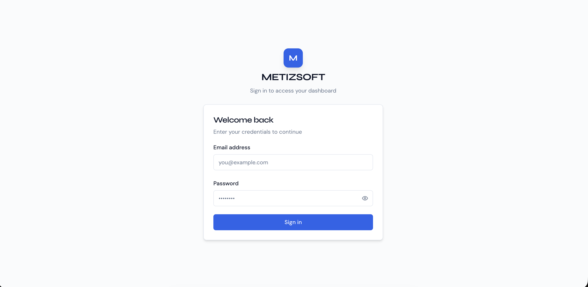
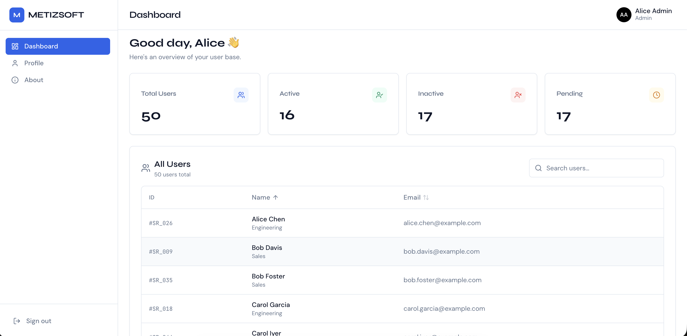
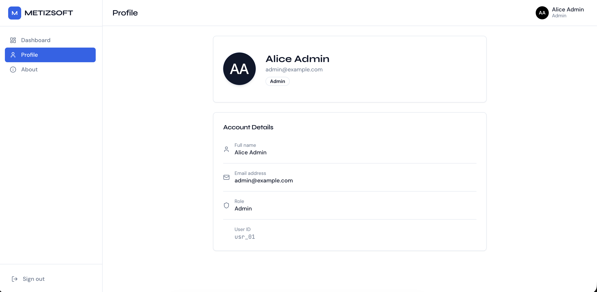

# METIZSOFT TASK

A Next.js dashboard project with login, protected pages, and a users table with search and pagination.

## Features

- App Router-based Next.js 14 project
- Email/password login with mock credentials
- Protected dashboard and profile routes
- JWT session stored in an HTTP-only cookie
- Search, sort, and pagination for the users table
- Shared layout with sidebar, navbar, and dashboard shell
- Form validation with Zod and React Hook Form

## Tech Stack

- Next.js 14
- React 18
- TypeScript
- Tailwind CSS
- Axios
- Zod
- React Hook Form
- TanStack Table
- jose for JWT handling

## Project Structure

```text
src/
  app/          # Pages, API routes, layout, middleware entry points
  components/   # UI, forms, layout, and data table components
  hooks/        # Client hooks for auth and users
  lib/          # API helpers, auth helpers, and utilities
  constants/    # Shared constants and route names
  types/        # Shared TypeScript types
```

## Prerequisites

- Node.js 18 or newer
- npm, yarn, pnpm, or bun

## Setup

1. Clone the repository.
2. Install dependencies.

```bash
npm install
```

3. Create your local environment file.

```bash
cp .env.example .env.local
```

4. Update `.env.local` with your local values.

```env
JWT_SECRET=replace-with-a-long-random-secret
NEXT_PUBLIC_API_BASE_URL=http://localhost:3000
```

5. Start the development server.

```bash
npm run dev
```

6. Open the app in your browser.

```text
http://localhost:3000
```

## Default Login

This project uses mock credentials for local development:

- Email: `admin@example.com`
- Password: `admin123`

## Screenshots

### Login



### Dashboard



### Profile



## How the App Works

- [`src/app/page.tsx`](src/app/page.tsx) checks for an active session and redirects to either `/dashboard` or `/login`.
- [`src/middleware.ts`](src/middleware.ts) protects `/dashboard` and `/profile` by verifying the auth cookie.
- [`src/app/api/login/route.ts`](src/app/api/login/route.ts) validates the login form against mock credentials and creates a JWT session cookie.
- [`src/app/api/logout/route.ts`](src/app/api/logout/route.ts) clears the auth cookie and signs the user out.
- [`src/app/api/users/route.ts`](src/app/api/users/route.ts) returns mock users with search, sort, and pagination support.
- [`src/lib/auth/session.ts`](src/lib/auth/session.ts) creates and verifies JWT tokens.
- [`src/hooks/useAuth.ts`](src/hooks/useAuth.ts) handles login and logout actions on the client.
- [`src/hooks/useUsers.ts`](src/hooks/useUsers.ts) keeps table state in sync with the URL and loads user data.
- [`src/components/data-table/DataTable.tsx`](src/components/data-table/DataTable.tsx) renders the table UI and handles loading, empty, and error states.
- [`src/components/layout/DashboardShell.tsx`](src/components/layout/DashboardShell.tsx) provides the sidebar and top bar layout for protected pages.

## Environment Files

- [`.env.example`](.env.example) is the safe template you commit to the repo.
- [`.env.local`](.env.local) is your private local config and should not be committed.

## API Routes

- `POST /api/login` - Sign in with the mock user
- `POST /api/logout` - Clear the session cookie
- `GET /api/users` - Fetch paginated user data

## Pages

- `/` - Redirects to the correct page based on session state
- `/login` - Login screen
- `/dashboard` - Main dashboard with stats and users table
- `/profile` - Protected profile page
- `/about` - Public about page
- `/404` - Custom not found page
